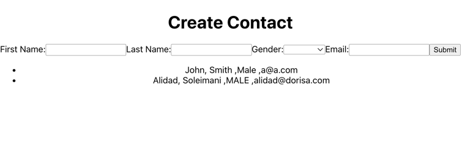
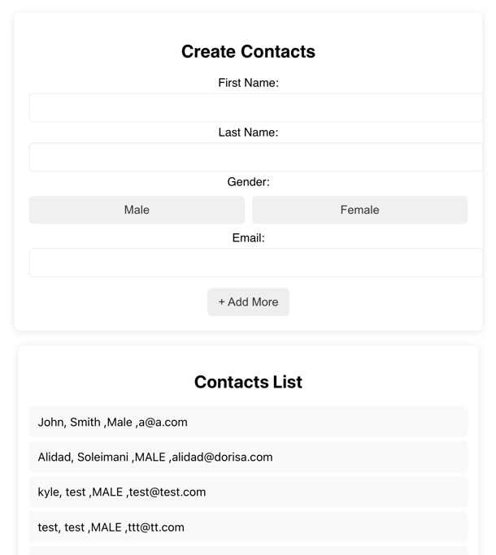

# Apex Phonebook React

## 🚀 Features & Updates

### ✅ Before:
- Saved new contacts correctly but **did not update the view** on successful save.

### 🛠 After:
- Updated `useState` logic to refresh the view **when a new contact is added**.
- Introduced a **bulk add** process to save multiple contacts at once.
- Added **a Notion-style UI** with better buttons, input fields, and animations.
- Replaced **gender dropdown** with a **toggle button**.
- Improved **user experience (UX)** by moving the "Save All" button inside the pending contacts section.
- Fixed **empty contact issues** that showed up after saving.

### 📷 Before & After Screenshots
#### ❌ Before: Contacts did not update in real-time


#### ✅ After: Contacts update in real-time 🎉


---

## 💻 How to Run the Project
1. Clone the repository:
   ```sh
   git clone https://github.com/kessenma/apex-phonebook-react.git
   cd apex-phonebook-react/phonebook